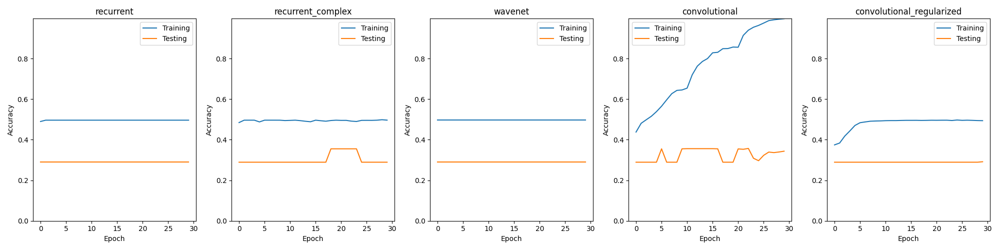

# EEGMMIDB Dataset and Preprocessing

## Overview

This repository provides instructions for downloading and preprocessing the EEGMMIDB dataset, a dataset commonly used for EEG (Electroencephalogram) analysis. The dataset is hosted on PhysioNet and contains EEG recordings from subjects performing motor imagery and executed movements.

## Getting Started

### Downloading the Dataset

To download the dataset, use the following command in the project root:

```bash
wget -r -N -c -np https://physionet.org/files/eegmmidb/1.0.0/
```

This command uses `wget` to recursively download the necessary files from the PhysioNet repository.

### Setting up the Environment

Create a virtual environment and install the required packages by running the following commands:

```bash
python -m venv venv
source venv/bin/activate  # On Windows, use `venv\Scripts\activate`
pip install -r requirements.txt
```

This ensures that you have a clean environment with all the dependencies.

### Preprocessing the Dataset

Run the preprocessing script to generate preprocessed TensorFlow datasets:

```bash
python preprocessing.py
```

Create the tf dataset running

```
python preprocessing.py
```

It is possible to change the values passed to each variable, but any changes will have to be adjusted in the model loader in the master.ipynb.
Example:

```
python preprocessing.py --batch_size 2 --stride 100 --n_steps 700
```

This script handles the necessary steps to preprocess the EEGMMIDB dataset and prepares it for further analysis.

### Preprocessing Discussion

#### 1. Data Loading and Label Encoding:

The `getXYdata` function extracts EEG signals (X) and labels (y) from the raw EEG recordings. The labels are encoded using `LabelEncoder` to convert categorical labels into a numerical format.

#### 2. Time Series Splitting:

The `splitTimeSeries` function segments the time series data into instances with a specified number of steps (`n_steps`) and a specified stride. Choosing appropriate values for these parameters is crucial for subsequent analysis.

#### 3. Generator Function:

The `generator_function` iterates over EEG recordings of different individuals and exams using MNE to read raw EEG data. It calls `getXYdata` and `splitTimeSeries` to yield segmented instances for training.

#### 4. TensorFlow Dataset Creation:

The `create_tf_dataset` function converts the generator function into a TensorFlow dataset, specifying the output signature for X and y.

#### 5. Command-Line Arguments:

Command-line arguments such as `--batch_size`, `--stride`, and `--n_steps` impact the preprocessing pipeline. The optional `--save` argument allows for saving the full train and test datasets.

#### 6. Dataset Splitting and Saving:

The full dataset is split into training and testing sets with an 80-20 split. Optionally, users can save the datasets using `tf.data.experimental.save`.

#### 7. Creating Smaller Datasets:

The `--tiny` argument allows for creating smaller datasets (`tiny_train_dataset` and `tiny_test_dataset`) useful for faster testing during development.

#### 8. Model comparison:

The following models were trained and tested with 5% of the original dataset separated into batches of 512 instances each, with a stride of 100 between the data points and 200 time steps per data point. Each model was trained with 30 epochs and the training and testing (validation) data do not overlap.




- Recurrent: a simple recurrent neural network was the first tested model, it clearly did not yield good results as it did underfitted severely and only predicted a single class on the test set.
- Recurrent Complex: a more complex recurrent neural network. It did also underfitted.
- Wavenet: Similar result to both recurrent models.
- Convolutional: A medium sized convolutional neural network. It overfitted and was the only model to predict different classes regularly over the dataset, all the other models only predicted a single class.
- Convolutional Regularized: In an attempt to stop the overfitting and improve performance over the test set the standard convolutional model was regulzarized using dropout layers, but it resulted in underfitting.

## Conclusion:

None of the models were able to predict the target variable with significant accuracy on the test set. The one which got the closest was the deep convolutional model.

## Next steps

The next steps will be:

- improving pre-processing: Adding fast fourier transform to the pre-processing layer and generating images from the dataset will greatly add to the depth of information and should improve drastically the performance of the convolutional models.
- Variational autoencoders: The state of the art papers in the field all use convolutional variational autoencoders to analyze and classify the resulting spectrograms from the fft, so these models might be the ideal tools to reach the envisioned goal of classifying motor imagery electro encephalogram datasets.

## References

The initial models used in this project are sourced from the following repository:

[https://github.com/ageron/handson-ml3/blob/main/15_processing_sequences_using_rnns_and_cnns.ipynb](https://github.com/ageron/handson-ml3/blob/main/15_processing_sequences_using_rnns_and_cnns.ipynb)

These models serve as a starting point for further development and experimentation with the EEGMMIDB dataset.
